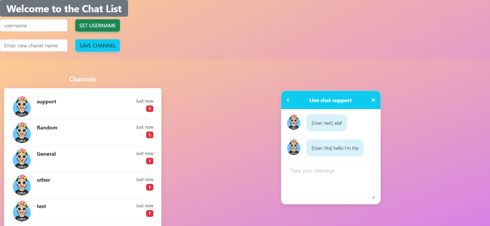

   <h1>Live Chat with React Js , Firebase , Electron - (Front-End Development)</h1>
	
✨@Cristian Yamil Salazar✨

   

  

Real-time application with react firebase mdbootstrap

The application has 3 stages, channel creation, sending and receiving live messages, it consists of a user, it can be executed through the web or in a desktop application.

The entered user can interact with different connected users or even create their own channel to discuss the topics that are suggested for them.

## View Web

## View Desktop

## Available Scripts

In the project directory, you can run:
### `npm install`

### `npm run start`

Runs the app in the development mode.\
Open [http://localhost:3000](http://localhost:3000) to view it in the browser.

The page will reload if you make edits.\
You will also see any lint errors in the console.

### `npm run electron`

Launches the app runner in the Desktop running.\

### `npm build`

Builds the app for production to the `build` folder.\
It correctly bundles React in production mode and optimizes the build for the best performance.

The build is minified and the filenames include the hashes.\
Your app is ready to be deployed!

See the section about [deployment](https://facebook.github.io/create-react-app/docs/deployment) for more information.

### Making a Progressive Web App

This section has moved here: [https://facebook.github.io/create-react-app/docs/making-a-progressive-web-app](https://facebook.github.io/create-react-app/docs/making-a-progressive-web-app)